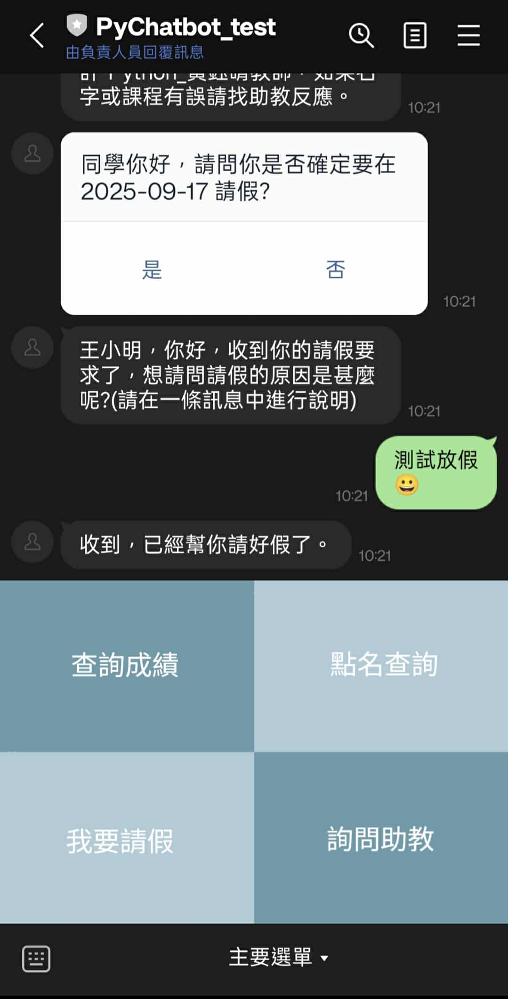

# Pychatbot

**PyChatbot** 是一個用於大學「Python 程式設計通識課」的互動型 LINE Bot 後端系統。
學生可透過此 Bot 查詢課程成績、出席狀況、提問課程問題，並接收教師的通知、總結評分與課堂回饋。



---

## 專案介紹

本專案為原始 PyChatbot 系統的 **重構版本**（2025/07 ~ 2025/09），
目標是將原本集中於單一巨型函式的 webhook 處理邏輯，重構為 **模組化、可維護、可測試的架構**。

## 系統概觀（非技術說明）

PyChatbot 是一個為課程設計的學習助教系統。  
它能讓學生透過 LINE Bot 完成：

- 查詢課程分數
- 查詢出席狀況
- 申請請假
- 提問課堂問題
- 查詢課堂總結成績
- 查詢課堂總結回饋
- 為助教提供回饋驗證平台

教師端則可發送通知與總結回饋。

本專案重構重點在於：

- 提升系統可維護性與測試性
- 導入自動化測試與容器化環境
- 讓開發與實際教學場景解耦

### 重構重點

* 採用 **Clean Architecture** 與 **Dependency Injection**（`dependency_injector`），
  將業務邏輯、資料層與介面層完全解耦。
* 將原本巨大的檔案拆分為多個 **Blueprint 模組**，以及拆分事件處理方式。
  分別處理：
  * 訊息事件
  * 加入好友(解除封鎖)事件
  * Postback 行為
  * 批次評分與回饋通知等
* 新增 **ThreadPoolExecutor 背景任務執行機制**，
  確保 webhook 能即時回覆 LINE 平台、同時在背景處理後續工作。
* 建立 **pytest 測試架構**，並整合 **GitHub Actions** 自動化測試流程。

### 重構成果

* 程式結構由單檔集中式改為明確的分層架構，維護性與可讀性顯著提升。
* 新功能（如 Summary 評分模組）可獨立開發、測試與部署。
* 整體開發流程自動化，降低人為錯誤風險。

---

## 測試與環境說明

本專案使用 `uv` 管理 Python 環境，並以 `pytest` 進行分層測試。  

### install dependencies

```bash
pip install --no-cache-dir -r requirements.txt
pip install --no-cache-dir gunicorn
```


### 測試分層對照表

| 測試標籤             | 說明                          | 是否需啟動容器 | 需啟動的 compose 檔 | 備註                        |
| ---------------- | --------------------------- | ------- | -------------- | ------------------------- |
| `unit`           | 單元測試：純邏輯測試、使用 mock / fake     | ❌ 否     | 無                      | 最快，完全不依賴外部服務              |
| `contract`       | 契約測試：驗證 fake/mock 與真實介面結構一致 | ❌ 否     | 無                      | 通常用於維持 API schema 一致性     |
| `infrastructure` | 基礎設施層測試：驗證資料庫連線              | ✅ 是     |   `compose.mysql.yml`   | 只需要準備 mysql 服務即可 |
| `integration`    | 整合測試：應用服務與多層依賴交互            | ✅ 是     |   `compose.mysql.yml`   | 測試腳本會替換第三方服務          |
| `e2e`            | 端對端測試：模擬實際運行場景                | ✅ 是     | `docker-compose.app.yml`| 須準備官方帳號並設置圖片   |

---

### 執行方式

#### 無需容器的測試

直接執行以下指令即可完成測試：

```bash
uv run -m pytest -m unit
uv run -m pytest -m contract
```

這些測試使用 **mock / fake**，不需要任何外部服務或 Docker。

---

#### 需啟動基礎設施（`compose.mysql.yml`）的測試

若要進行資料庫測試（`infrastructure`）：

1. `cp .env.example .env.test`
2. `docker compose -f compose.mysql.yml up -d mysql-dev`
3. `uv run -m pytest -m infrastructure`

or

1. `docker compose -f compose.mysql.yml up -d mysql-dev`
2. `CHATBOT_DB_PASSWORD=root CHATBOT_DB_USER=root \
LINEBOT_DB_NAME=linebot_test VERIFY_DB_NAME=GenAI_verify_test REVIEW_SYSTEM_DB_NAME=review_system_test \
uv run -m pytest -m infrastructure`

若要進行資料庫測試（`integration`）：

1. `cp .env.example .env.test`
2. `docker compose -f compose.mysql.yml up -d mysql-dev`
3. `uv run -m pytest -m integration`

or

1. `docker compose -f compose.mysql.yml up -d mysql-dev`
2. `CHATBOT_DB_PASSWORD=root CHATBOT_DB_USER=root \
LINEBOT_DB_NAME=linebot_test VERIFY_DB_NAME=GenAI_verify_test REVIEW_SYSTEM_DB_NAME=review_system_test \
MOODLE_DB_PORT=5432 MOODLE_SSH_PORT=22 OJ_DB_PORT=5432 OJ_SSH_PORT=22 \
uv run -m pytest -m integration`

---

#### 端對端測試（`docker-compose.app.yml`）

此模式會啟動完整應用（app + MySQL + Moodle），
需具備 LINE 官方帳號與 rich menu 設置。

若只想了解系統架構與測試機制，可略過本段落。

1. 申請 LINE Official Account，取得 Access Token 與 Channel Secret
2. 使用 line_menu/ 內腳本建立並設置 rich menu
3. 準備 webhook 網址（如 ngrok）
4. 複製設定檔：`cp .env.example .env` 並填入必要變數
5. 啟動環境：`docker compose -f docker-compose.app.yml up --build`
6. 手機加入帳號後測試互動（註冊、請假、選單切換等）

---

## 未完全重構、測試完成的部分

1. student summary 功能: summary_usecases 沒有撰寫測試
2. 驗證回饋功能: 沒有撰寫測試

## 已知問題

### Race Condition

由於 LINE 平台請求可能同時抵達伺服器，
若前一個請求尚未完成（尚未更新使用者狀態），
而下一個請求提早進入處理流程，
可能導致使用者狀態錯誤或非預期行為。

---

## 專案結構

```bash
pychatbot/
├── main.py                  # 主應用程式入口（啟動 Web 伺服器與容器註冊）
├── containers.py            # Dependency Injection 容器
│
├── application/             # 應用層：整合業務流程與外部介面，實作 Use Cases
│   ├── *_service.py         # 各功能服務（成績查詢、出席、請假、建議、評分等）
│   ├── ports/               # 
│   ├── message_builders/    # LINE 訊息建構工具
│   ├── summary_usecases/    # 
│   └── user_state_accessor.py # 使用者狀態管理工具
│
├── domain/                  # 核心業務邏輯如學生、課程等 (Entities / Value Objects)
│
├── infrastructure/          # 基礎設施層：資料庫與外部服務實作 (Repositories / Gateways)
│   ├── mysql_*_repository.py
│   ├── postgresql_*_repository.py
│   └── gateways/            # 外部 API 或通訊介面實作
│
├── interfaces/              # 介面層：對外暴露的介面，如 Webhook / HTTP API
│
├── config/                  # 組態與環境變數設定
│
├── specs/                   # 系統功能需求描述（Specification）
│
├── templates/               # 網頁模板與電子信件模板
│
├── tests/                   # 測試目錄（依分層對應）
│   ├── application/
│   ├── domain/
│   ├── infrastructure/
│   ├── interfaces/
│   └── conftest.py
├── docker/                  # Docker 設定檔與 script
├── line_menu/               # LINE rich menu 設置相關腳本
├── cli.py                   # CLI 工具（手動設置 webhook 網址）
├── gunicorn.conf.py         # Gunicorn 設定
├── pyproject.toml           # 專案設定與依賴
├── requirements.txt         # Python 依賴列表
├── uv.lock                  # uv 鎖定檔
└── README.md

```

---

## Tech Stack

* **Python 3.12+**
* **Flask** — Web 應用框架
* **Dependency Injector** — 管理跨層依賴
* **ThreadPoolExecutor** — 處理背景任務與並行 webhook
* **Pytest** — 單元與整合測試框架
* **GitHub Actions** — CI/CD 自動化測試與部署
* **Docker Compose** — 管理多服務測試環境
